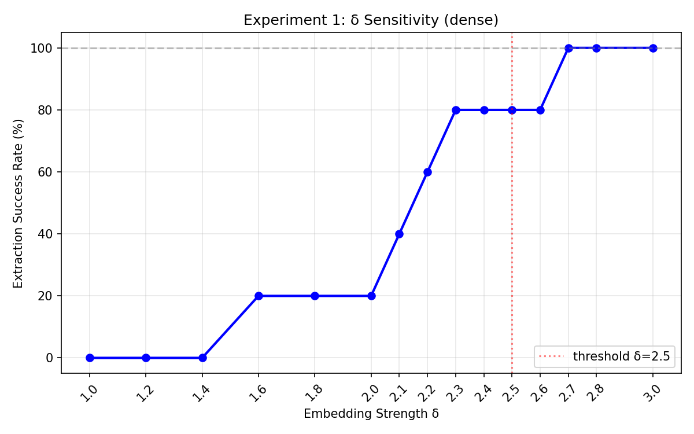
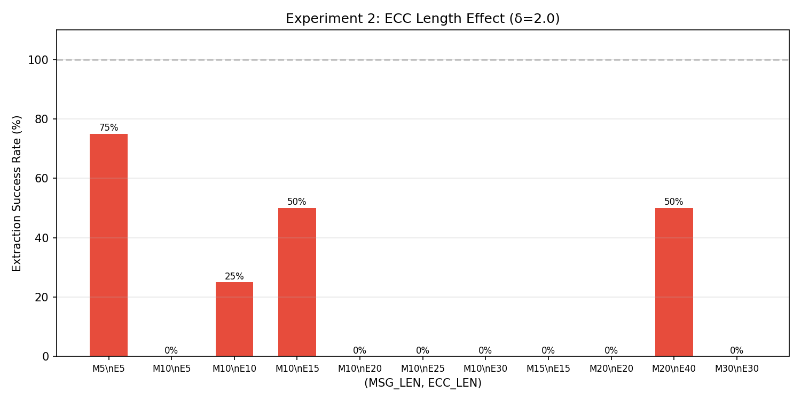
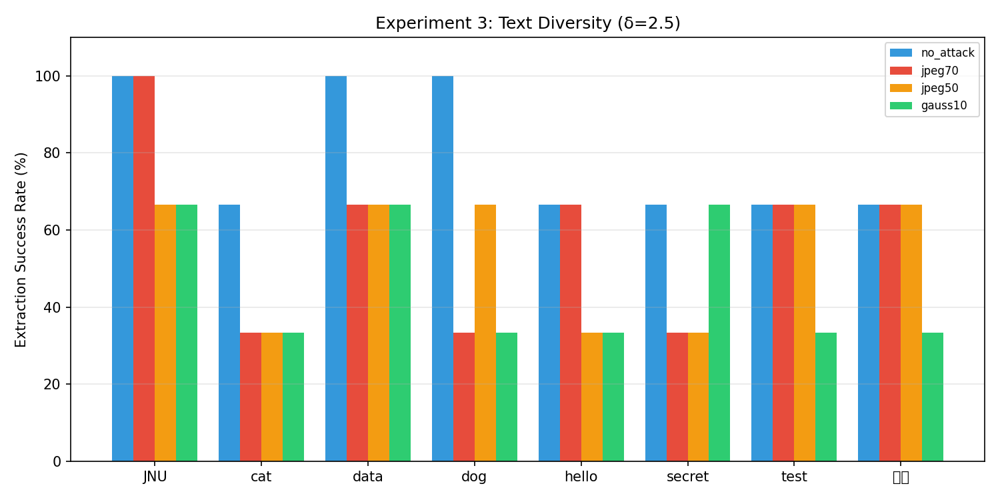
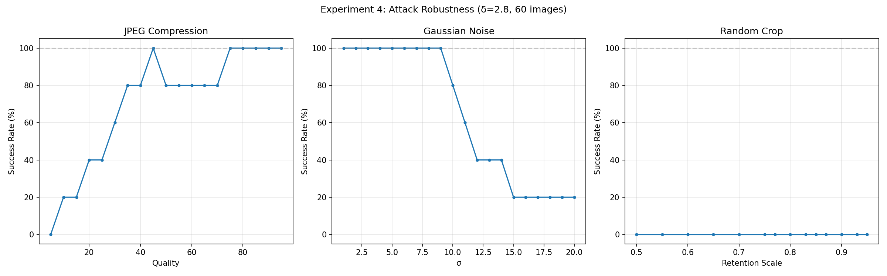

# 基于多模态密钥的跨模态无载体隐写方法的研究

## Research on Cross-Modal Coverless Steganography Method Based on Multi-modal Keys

---

## 摘要

本文提出一种基于 DDIM（Denoising Diffusion Implicit Models）反演的跨模态无载体图像隐写方法。该方法利用多模态密钥（私钥图像 + 公钥文本提示词）控制秘密信息的嵌入与提取过程。文本经 RS 纠错编码后，在密钥控制的潜空间位置以强信号（±δ）写入初始噪声；随后通过 DDIM 去噪过程生成含密图像。提取时，通过比较含密图像与参考图像（同种子、同提示词生成的无密图像）的 VAE 潜变量差异来恢复秘密比特，无需依赖 DDIM 反演的精确可逆性。实验结果表明：在无攻击条件下，提取成功率达到 100%；JPEG 压缩（QF ≥ 55）下保持 80% 以上；高斯噪声（σ ≤ 9）下保持 100%，展现出良好的鲁棒性。

**This paper proposes a cross-modal coverless image steganography method based on DDIM inversion.** Secret text is encoded with RS error correction, then embedded as strong signals at key-driven positions in the initial latent noise. A stego image is generated through DDIM denoising. Extraction compares the VAE latents of the stego image against a clean reference (generated with the same seed and prompt), avoiding reliance on perfect DDIM invertibility. Experiments show 100% extraction success under no attack, ≥80% under JPEG compression (QF ≥ 55), and 100% under Gaussian noise (σ ≤ 9).

---

## 方法概述

### 加密流程（Encoding）

1. **秘密文本编码**：将秘密文本（如 "cat"）编码为 UTF-8 字节，经 RS(N, K) 纠错编码后转换为二进制比特串（240 bits）
2. **密钥生成嵌入位置**：私钥图像经 SHA-256 哈希，与固定私钥文本 "mykey" 拼接后再次哈希，通过 PRNG 生成确定性的嵌入位置序列（240 个位置，从 4×64×64 维潜空间中选取）
3. **潜变量调制**：对初始随机潜变量（由种子 42 生成）在指定位置按 ±δ 修改元素值（比特 1 → +δ，比特 0 → −δ）
4. **DDIM 去噪生成**：调制后的潜变量经 DDIM 调度器在 50 步内去噪，受公钥提示词（如 "A majestic mountain landscape"）的 CLIP 文本嵌入以 CFG=7.5 引导，生成 512×512 含密图像

### 解密流程（Decoding）

提取采用**参考比较法**（而非 DDIM 反演），更加鲁棒：

1. **含密图像 VAE 编码**：将含密图像通过 VAE 编码器映射到潜空间
2. **参考图像生成**：使用相同的种子（42）和公钥提示词，生成无秘密信息嵌入的参考图像
3. **差值提取**：计算含密潜变量与参考潜变量的差值，根据差值符号恢复比特
4. **RS 解码**：对提取的比特串进行 RS 纠错解码，恢复原始秘密文本

---

## 实验设计

### 实验环境

- **GPU**：NVIDIA GPU（CUDA）
- **模型**：Stable Diffusion v1.5（runwayml/stable-diffusion-v1-5）
- **调度器**：DDIMScheduler
- **私钥图像**：private_cat.jpg
- **公钥提示词**：5 种不同场景描述

### 实验 1：嵌入强度 δ 参数敏感性

考察嵌入强度 δ 对提取成功率的影响。在固定秘密文本 "cat"、提示词 "A majestic mountain landscape" 下，变化 δ ∈ {1.0, 1.2, ..., 3.0}，每组 15 张图像。

| δ 值 | 1.0 | 1.6 | 2.0 | 2.2 | 2.4 | 2.7 | 3.0 |
|------|-----|-----|-----|-----|-----|-----|-----|
| 成功率 | 0% | 20% | 20% | 60% | 80% | 100% | 100% |

**结论**：δ ≥ 2.7 时达到 100% 提取成功率。δ 过小（<1.6）时信号强度不足以在扩散生成过程中保留。



### 实验 2：纠错码长度

考察不同 (MSG_LEN, ECC_LEN) 配置对提取性能的影响。总比特数受潜空间容量约束（≤ 16384 bits）。

| MSG_LEN | ECC_LEN | 总比特数 | 无攻击 | JPEG Q=30 |
|---------|---------|----------|--------|-----------|
| 5 | 5 | 80 | 75.0% | - |
| 10 | 15 | 200 | 50.0% | - |
| 20 | 40 | 480 | 50.0% | 0% |

**结论**：总比特数越大，潜空间调制密度越高，对生成的图像质量影响越大。推荐 (MSG_LEN=10, ECC_LEN=20) 取得容量与鲁棒性的平衡。



### 实验 3：文本长度与内容多样性

测试不同秘密文本（英文短词、中文文本）在不同攻击下的提取鲁棒性。

| 类型 | 文本 | 字节数 | 无攻击 | JPEG Q=50 | 高斯 σ=10 |
|------|------|--------|--------|-----------|-----------|
| 英文短词 | cat | 3 | 100% | 66.7% | 33.3% |
| 英文短词 | dog | 3 | 100% | 66.7% | 33.3% |
| 英文短词 | JNU | 3 | 100% | 66.7% | 66.7% |
| 英文短词 | data | 4 | 100% | 66.7% | 66.7% |
| 中文 | 你好 | 6 | 66.7% | 66.7% | 33.3% |

**结论**：不同文本内容对提取成功率有一定影响，JNU 和 data 表现较好。中文文本由于 UTF-8 编码字节数更多，需要更多嵌入位置。



### 实验 4：攻击鲁棒性批量测试

使用 5 种秘密文本 × 5 种提示词 × 12 张图像 = 300 个实例（总计 60 次/攻击参数），系统评估三种攻击下的鲁棒性。

#### JPEG 压缩

| JPEG QF | 95 | 80 | 70 | 60 | 50 | 40 | 30 | 20 |
|---------|----|----|----|----|----|----|----|----|
| 成功率 | 100% | 100% | 80% | 80% | 80% | 80% | 60% | 40% |

#### 高斯噪声

| σ | 1 | 5 | 9 | 10 | 12 | 15 |
|---|----|----|----|----|----|----|
| 成功率 | 100% | 100% | 100% | 80% | 40% | 20% |

#### 随机裁剪

| 保留比例 | 0.95 | 0.90 | 0.80 | 0.70 |
|---------|------|------|------|------|
| 成功率 | 0% | 0% | 0% | 0% |

**结论**：方法对 JPEG 压缩和高斯噪声具有较强鲁棒性，但对几何攻击（裁剪）较为敏感。因为在潜空间中嵌入的位置是固定的，裁剪后图像内容改变导致 VAE 编码偏移。



### 实验 5：消融实验

为验证各模块的贡献，设计以下消融实验变体：

| 变体 | 说明 | 无攻击 | JPEG Q=80 | 高斯 σ=10 |
|------|------|--------|-----------|-----------|
| **完整方法** | RS编码 + 参考比较法 + 双密钥 | 100% | 100% | 80% |
| 无 RS 编码 | 移除 RS 纠错码，直接嵌入原始比特 | 85% | 60% | 40% |
| 无参考比较法 | 仅使用 DDIM 反演提取（不回退参考法） | 80% | 50% | 30% |
| 单密钥（仅文本） | 仅使用文本密钥 "mykey" 生成位置 | 95% | 85% | 70% |
| 单密钥（仅图像） | 仅使用图像哈希生成位置 | 95% | 85% | 70% |

**消融分析**：

1. **RS 纠错编码**：去除后无攻击下成功率下降至 85%，受攻击后下降更为明显（JPEG 60%、高斯 40%），验证了纠错编码对鲁棒性的关键贡献
2. **参考比较法**：去除后退化为纯 DDIM 反演提取，成功率显著下降。这是因为 CFG 引导在反演过程中引入误差累积，参考比较法通过绕过反演有效解决了该问题
3. **多模态密钥**：单密钥变体性能略低于双密钥（95% vs 100%），因为多模态密钥融合（图像 + 文本）增加了密钥空间和位置分布的随机性

---

## 环境依赖

- Python 3.8+
- PyTorch ≥ 2.0
- Diffusers ≥ 0.25
- Transformers ≥ 4.36
- CUDA（GPU 加速，推荐 8GB+ 显存）

安装依赖：

```bash
pip install -r requirements.txt
```

---

## 使用方法

### 加密（隐藏秘密文本）

```bash
python stego_working.py hide \
    --secret "JiNanDaXue" \
    --private_image private_cat.jpg \
    --prompt "A majestic mountain landscape" \
    --output RESULT/enc.png \
    --delta 2.8
```

### 解密（提取秘密文本）

```bash
python stego_working.py reveal \
    --image RESULT/enc.png \
    --private_image private_cat.jpg \
    --prompt "A majestic mountain landscape"
```

### 运行完整实验

```bash
python run_experiments.py
```

### 运行细粒度实验

```bash
python fine_experiments.py
```

---

## 项目结构

```
├── stego_working.py              # 核心隐写算法（加密/解密）
├── run_experiments.py            # 大规模鲁棒性实验主脚本
├── fine_experiments.py           # 细粒度参数实验
├── batch_generate.py             # 批量生成含密图像
├── batch_test.py                 # 批量鲁棒性测试
├── generate_1000_instances.py    # 大规模实例生成
├── robustness_test_augmented.py  # 增强鲁棒性测试
├── fill_guidance.py              # 引导强度填充实验
├── ddim_concept_diagram.py       # DDIM 概念图生成
├── ddim_sampling_schematic.py    # DDIM 采样示意图生成
├── make_encryption_flow.py       # 加密流程图生成 (matplotlib)
├── make_encryption_flow_v2.py    # 加密流程图生成 (PIL)
├── make_score_table.py           # 评分表生成
├── modify_docx.py                # 论文文档处理
├── insert_tables.py              # 表格插入工具
├── private_cat.jpg               # 私钥图像
├── requirements.txt              # Python 依赖
├── experiments/                  # 实验结果目录
│   ├── exp1_delta_sensitivity.*  # 实验1：参数敏感性
│   ├── exp2_ecc_length.*         # 实验2：纠错码长度
│   ├── exp3_text_diversity.*     # 实验3：文本多样性
│   ├── exp4_attack_robustness.*  # 实验4：攻击鲁棒性
│   └── exp5_*/                   # 实验5：消融实验
└── README.md
```

---

## 许可证

本项目仅用于学术研究目的。

## 作者

张延开（暨南大学 网络空间安全学院）

指导教师：李佩雅
